# Retail Sales Performance Analytics


**Python · SQLite · SQL · Power BI · Tableau · Scikit-learn · Pandas**

An end-to-end retail analytics project analyzing nearly 10,000 transactions to uncover sales trends, profitability drivers, and regional performance — built to mirror a real data analyst engagement, from raw data to executive-ready dashboards.

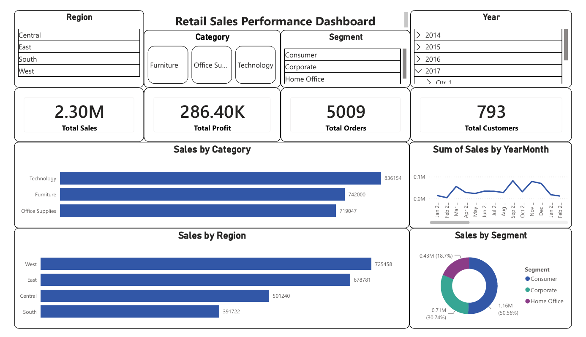

## Live Dashboards

- 📊 **Tableau Public:** [https://public.tableau.com/views/RetailSalesPerformanceDashboard_17855286480520/RetailSalesPerformanceDashboard](https://public.tableau.com/views/RetailSalesPerformanceDashboard_17855286480520/RetailSalesPerformanceDashboard?:language=en-US&publish=yes&:sid=&:redirect=auth&:display_count=n&:origin=viz_share_link)
- 📁 **Power BI:** Included in [`/dashboards/PowerBI/`](dashboards/PowerBI/) (`.pbix` file included in repository)

## Business Problem

*"We have millions in sales data. Tell us what's happening, why it's happening, and what we should do."*

This project answers that brief — identifying which categories, regions, and segments drive revenue and profit, where profitability is at risk, and what actions could improve performance.

## Dataset

- **Source:** Sample Superstore dataset (Kaggle / Tableau sample data)
- **Size:** 9,994 transactions, 21+ columns (orders, customers, products, regions, profit)
- **Data quality:** 0 missing values, 0 duplicate records — verified during cleaning

## Tools Used

| Tool | Purpose |
|---|---|
| **SQLite** | Relational database for business-query practice |
| **SQL** | KPI queries, segmentation, window functions, reusable views |
| **Python (Pandas, SciPy, Scikit-learn)** | Data cleaning, EDA, statistical testing, sales prediction |
| **Power BI** | Interactive executive dashboard |
| **Tableau** | Cross-platform BI dashboard |

## Architecture

```
Raw Excel Dataset
        │
        ▼
Python Data Cleaning
        │
        ▼
Exploratory Data Analysis
        │
        ▼
Statistical Analysis
        │
        ▼
SQLite Database
        │
        ▼
SQL Business Queries
        │
        ▼
Power BI Dashboard
        │
        ▼
Tableau Dashboard
        │
        ▼
Business Recommendations
```

## Key Insights

- **Total sales: $2.30M** across **5,009 orders** and **793 unique customers**
- **Total profit: $286.4K** (12.47% profit margin, $57.18 average profit per order)
- **Technology** is the strongest category — highest sales ($836K) *and* highest profit ($145K)
- **Furniture** generates strong sales ($742K) but the **lowest profit** of any category ($18K) — a margin problem, not a demand problem
- **Texas** ranks #3 in sales but falls out of the top profit-generating states — a profitability, not a volume, issue
- Sales peak seasonally between **September and December**; the business grew steadily from **$484K (2014) to $733K (2017)**
- Discounts above ~30% are associated with **negative average profit per order** — discounting is actively eroding margin past that threshold
- A Pearson correlation confirms a statistically significant moderate positive relationship between Sales and Profit (r = 0.48, p < 0.0001); an independent t-test confirms Technology is significantly more profitable than Furniture (p < 0.0001); a one-way ANOVA found **no significant difference** in average sales across customer segments (p = 0.55)
- A Random Forest and Linear Regression model (R² ≈ 0.19) identified **Quantity, Shipping Days, Discount, and Sub-Category** as the strongest predictors of sales value

Full narrative in [`reports/executive_summary.md`](reports/executive_summary.md).

## Project Workflow

### 1. Data Cleaning
Loaded raw Excel data, converted to CSV, verified zero missing values and zero duplicates, engineered date-based features (order year/month/quarter/day, shipping days).
→ [`notebooks/01_data_cleaning.ipynb`](notebooks/01_data_cleaning.ipynb)

### 2. Exploratory Data Analysis
Answered core business questions — performance by category, region, segment, state, and time — plus discount-vs-profit and top product/customer analysis.
→ [`notebooks/02_eda.ipynb`](notebooks/02_eda.ipynb)

### 3. Statistical Analysis
Validated EDA findings with hypothesis testing: Pearson correlation (Sales vs Profit), independent t-test (Technology vs Furniture profit), and one-way ANOVA (sales across segments).
→ [`notebooks/03_statistical_analysis.ipynb`](notebooks/03_statistical_analysis.ipynb)

### 4. Machine Learning
Built and compared Linear Regression and Random Forest models to predict order-level sales from operational and categorical features, with feature importance analysis.
→ [`notebooks/04_modeling.ipynb`](notebooks/04_modeling.ipynb)

### 5. SQL Analysis
Loaded the cleaned dataset into a SQLite database and developed 60+ SQL queries including KPI analysis, reusable views, CTEs, window functions, ranking, running totals, customer segmentation, product analysis, and profitability reports.
→ [`sql/`](sql/) · [`database/superstore.db`](database/superstore.db)

### 6. Power BI Dashboard
Two-page executive dashboard with KPI cards, category/region/segment breakdowns, top states, profit-by-sub-category, and a sales-vs-profit scatter plot, filterable by Region, Category, Segment, and Year. Power BI (`.pbix`) file included in repository.
→ [`dashboards/PowerBI/`](dashboards/PowerBI/) | [Page 1](images/powerbi/powerbi_dashboard_1.png) · [Page 2](images/powerbi/powerbi_dashboard_2.png)

### 7. Tableau Dashboard
Single-page dashboard rebuilding the core KPIs and breakdowns to demonstrate cross-platform BI proficiency.
→ [`dashboards/Tableau/`](dashboards/Tableau/) | [Live Dashboard](https://public.tableau.com/views/RetailSalesPerformanceDashboard_17855286480520/RetailSalesPerformanceDashboard?:language=en-US&publish=yes&:sid=&:redirect=auth&:display_count=n&:origin=viz_share_link) · [Screenshot](images/tableau/tableau_dashboard.png)

## Dashboard Preview

### Power BI Dashboard


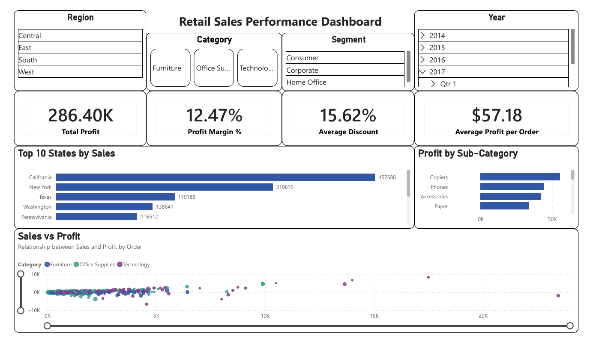

### Tableau Dashboard

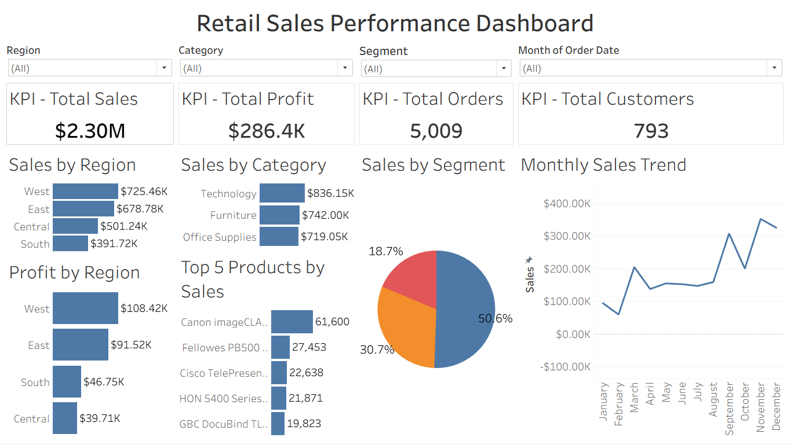

🔗 **Interact with it live:** [Tableau Public](https://public.tableau.com/views/RetailSalesPerformanceDashboard_17855286480520/RetailSalesPerformanceDashboard?:language=en-US&publish=yes&:sid=&:redirect=auth&:display_count=n&:origin=viz_share_link)

## SQL Query Results

Beyond the dashboards, the core business questions behind this project were first answered directly in SQL — KPI totals, regional and category breakdowns, top performers, and trend analysis — with every result verified against the SQLite database before being visualized in Power BI and Tableau. The screenshots below show the query outputs.

### Total Sales
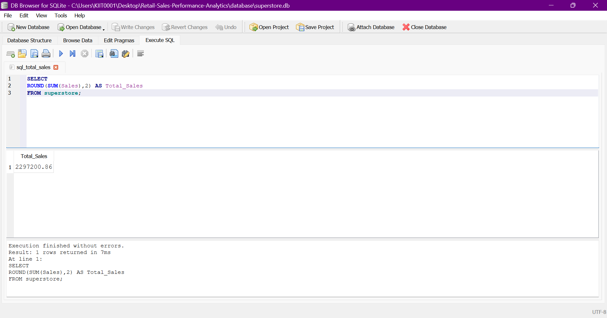

### Total Profit
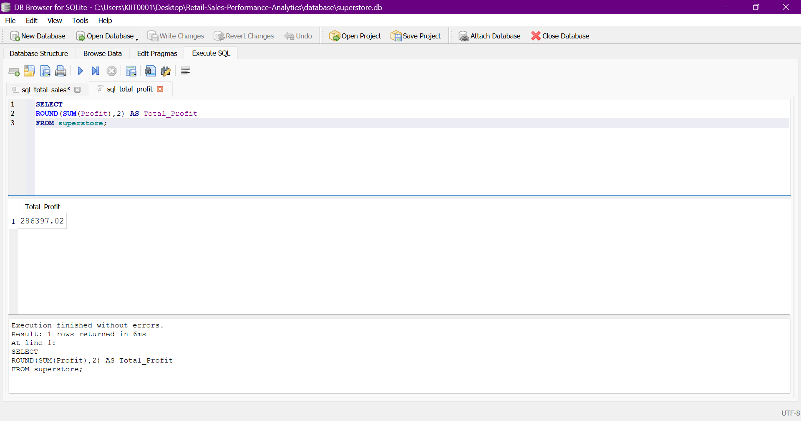

### Sales by Region
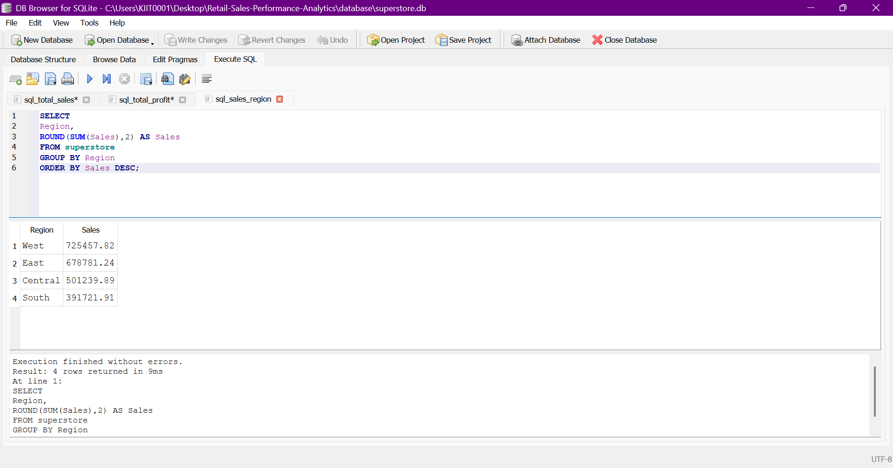

### Sales by Category
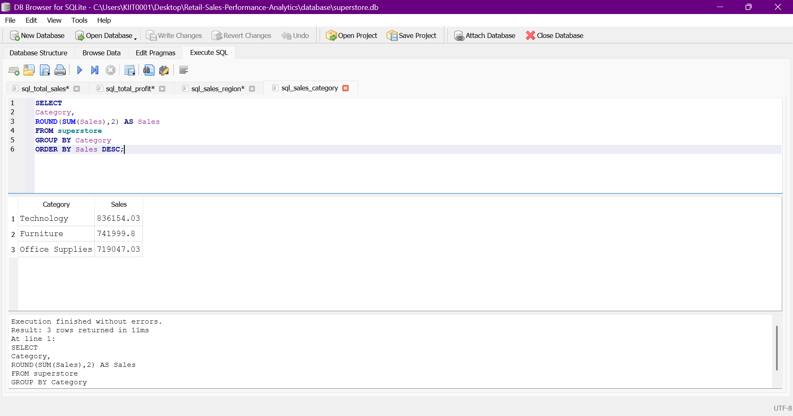

### Profit by Category
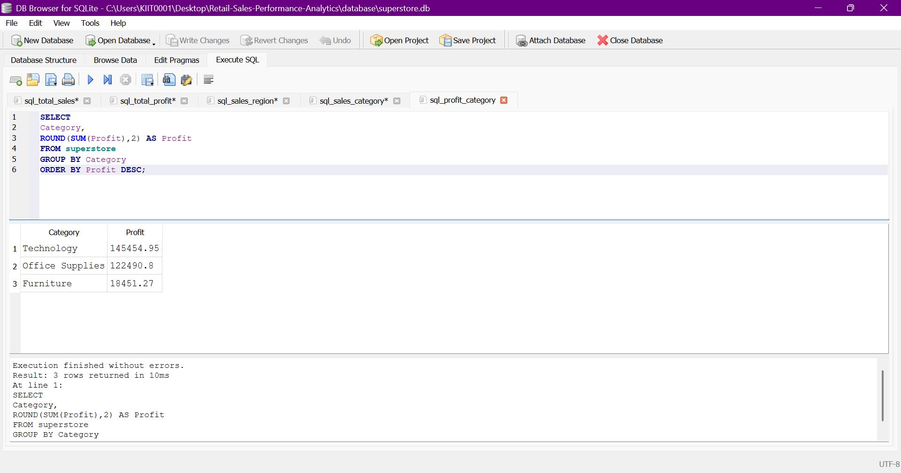

### Top Products
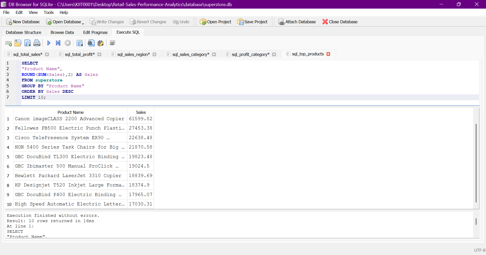

### Top Customers
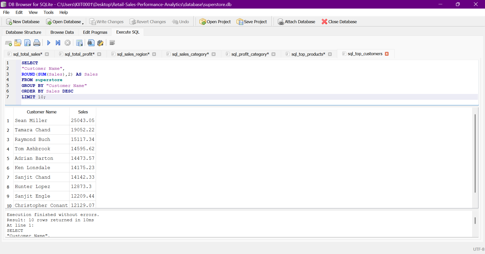

### Monthly Sales Trend
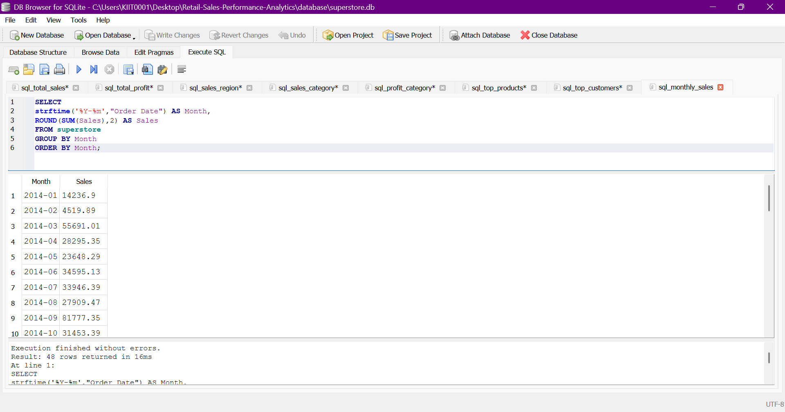

### Profit Contribution by Region
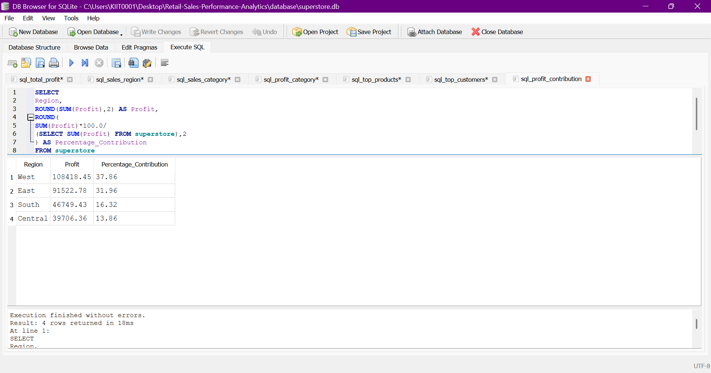

### Overall Profit Margin
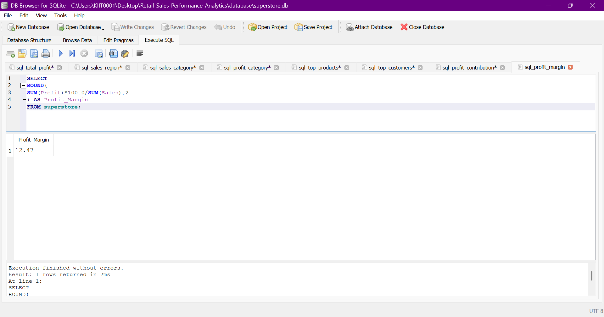

## Business Recommendations

1. **Review Furniture pricing and discount strategy** — the category drives strong revenue but the weakest margins of the three; current pricing isn't converting sales into profit.
2. **Increase investment in Technology** — it has the highest sales and profit margin; scaling marketing spend here has the best risk-adjusted return.
3. **Audit high-discount orders** — discounts above ~30% correlate with negative profit; a discount ceiling or approval threshold could meaningfully protect margin.
4. **Investigate Texas's profitability gap** — despite ranking #3 in sales, it doesn't place in the top profit-generating states, suggesting cost, discounting, or logistics issues specific to that market.
5. **Plan inventory and staffing for the Sep–Dec peak** — seasonal demand is consistent and predictable enough to plan around.

## Skills Demonstrated

- Data Cleaning
- Exploratory Data Analysis
- Statistical Analysis
- SQL
- SQLite
- Database Design
- Business Intelligence
- Dashboard Design
- Power BI
- Tableau
- Feature Engineering
- Machine Learning
- Data Storytelling
- Business Recommendations

## Repository Structure

```
Retail-Sales-Performance-Analytics/
│
├── dashboards/
│   ├── PowerBI/
│   │   └── Retail-Sales-Performance-Dashboard.pbix
│   └── Tableau/
│       └── Retail-Sales-Performance-Dashboard.twbx
│
├── data/
│   ├── raw/
│   │   ├── superstore.csv
│   │   └── superstore.xls
│   │
│   └── processed/
│       └── superstore_cleaned.csv
│
├── database/
│   └── superstore.db
│
├── images/
│   ├── powerbi/
│   │   ├── powerbi_dashboard_1.png
│   │   └── powerbi_dashboard_2.png
│   ├── tableau/
│   │   └── tableau_dashboard.png
│   └── sql/
│       ├── sql_total_sales.png
│       ├── sql_total_profit.png
│       ├── sql_sales_region.png
│       ├── sql_sales_category.png
│       ├── sql_profit_category.png
│       ├── sql_top_products.png
│       ├── sql_top_customers.png
│       ├── sql_monthly_sales.png
│       ├── sql_profit_contribution.png
│       └── sql_profit_margin.png
│
├── notebooks/
│   ├── 01_data_cleaning.ipynb
│   ├── 02_eda.ipynb
│   ├── 03_statistical_analysis.ipynb
│   └── 04_modeling.ipynb
│
├── reports/
│   └── executive_summary.md
│
├── scripts/
│   ├── create_database.py
│   └── test_db.py
│
├── sql/
│   ├── business_queries.sql
│   ├── create_tables.sql
│   ├── data_validation.sql
│   ├── superstore_analysis.sql
│   └── views.sql
│
├── .gitignore
├── LICENSE
├── README.md
└── requirements.txt
```

## Future Work

- Add a customer lifetime value (CLV) view to segment customers by long-term value, not just order-level sales
- Extend the model with external features (marketing spend, seasonality indices, competitor pricing) to improve R²
- Automate the SQLite → dashboard refresh pipeline for live data updates

## Author

**Dheeraj Paul**

GitHub: [https://github.com/dheerxj24](https://github.com/dheerxj24)

LinkedIn: [www.linkedin.com/in/dheeraj-paul-175515333](https://www.linkedin.com/in/dheeraj-paul-175515333)

---

⭐ If you found this project useful, consider giving it a star.